# Boney — creation to settlement

The end-to-end flow as the contracts actually implement it today.

Each diagram is a checked-in SVG with its Mermaid source collapsed underneath. The SVGs are
generated from that source (`mermaid-cli`, `htmlLabels: false` so GitHub's SVG sanitizer cannot
strip the labels), so they display regardless of whether a viewer renders Mermaid. Edit the source,
re-render, commit both.

Cast of contracts:

| Contract | Role |
|---|---|
| `Boney` | Optional facade. Holds no funds, has no privileged role — every call it makes could be made directly. |
| `CampaignRegistry` | Factory + directory. The only account that may bind a campaign to a token in the vault. |
| `Campaign` | One campaign. Immutable config, KPI specs, tier ladders, progress, settlement. |
| `EscrowVault` | Custody. Knows a campaign's token and balance, nothing about KPIs. |
| `AttributionRegistry` | Which promoter owns which end user, per campaign. LAST_TOUCH, user-signed. |
| `ReputationRegistry` | Composite score from attested metrics. Read once, at join. |
| `OracleCoordinator` | Staked reporting with an optimistic dispute window. |
| `*KpiVerifier` | Optional adapters that may only ever *reduce* a claim. |

<details>
<summary>Plain-text version of the whole flow (no rendering required)</summary>

```
CREATION                          Pending
  Project --createCampaign--> CampaignRegistry
                                |  Names.key(name) -> NameTaken if claimed
                                |  new Campaign(...) validates window/tiers/minReputation
                                +- EscrowVault.registerCampaign(campaign, token)
                                   only the registry may bind a campaign to a token

FUNDING + ACTIVATION              Pending --> Active
  Project --approve+deposit--> EscrowVault    credits what ACTUALLY arrived
  Project --activate()--> Campaign            balanceOf >= rewardPool, else NotFunded

PROMOTER                          join() allowed while Pending too
  KOL --join()--> Campaign --scoreOf--> ReputationRegistry   (read once, at join)
                     +- registerPromoter(keccak(campaign, promoter)) --> AttributionRegistry

ATTRIBUTION  <- the consent step, and the anti-abuse primitive
  KOL -link(promoterId)-> End user --signs EIP-712 Touch--+
  anyone relays --storeTouch()--> AttributionRegistry <---+
     lands only if: signedAt <= now < expiresAt <= now + min(attributionWindow, cap)
                    campaign not past endTime and not terminal
                    signedAt STRICTLY newer than stored          (LAST_TOUCH)

REPORTING --> SETTLEMENT          one transaction, no separate claim
  Project -------------+
                       +--> Campaign.reportUserAction(kpi, user, newTotal, evidence)
  Reporter -stake-> OracleCoordinator -submitUserReport-> [dispute window] -apply-+
                       +- governor disputes -> slashed, never applied

     resolve promoter --> live touch? yes -> them
                          no + Ended -> stored touch (expired OK)
                          no          -> revert NoAttribution
     verifier? --> GuardedKpiVerifier --always--> EventMetricKpiVerifier (relayer scan)
                                      +-optional-> project verifier
                    AGREE: diverge over tolerance -> revert   CAP: min(boney, project)
                    may only SHRINK a claim, never redirect the payee
     credit = verifiedTotal - alreadyCredited     (cumulative, so replay is a no-op)
     _settle() walks the tier ladder INLINE --> EscrowVault.release(promoter, tierPay)
                    tierPay = min(reward, pool - paidOut); tier marked settled either way
                    short -> PoolExhausted, never reverts

WIND-DOWN                         Active/Paused --> Ended
  end()            project anytime, or ANYONE once past endTime
  |- CLAIM_GRACE = 20 min: reporting still open
  +- reclaimUnspent()  only after grace -> EscrowVault.reclaim(project, remainder)

  reporting closes exactly where reclaim opens - never both, so escrow is never
  reclaimable while credit is still owed
```

</details>

---

## 1. The happy path

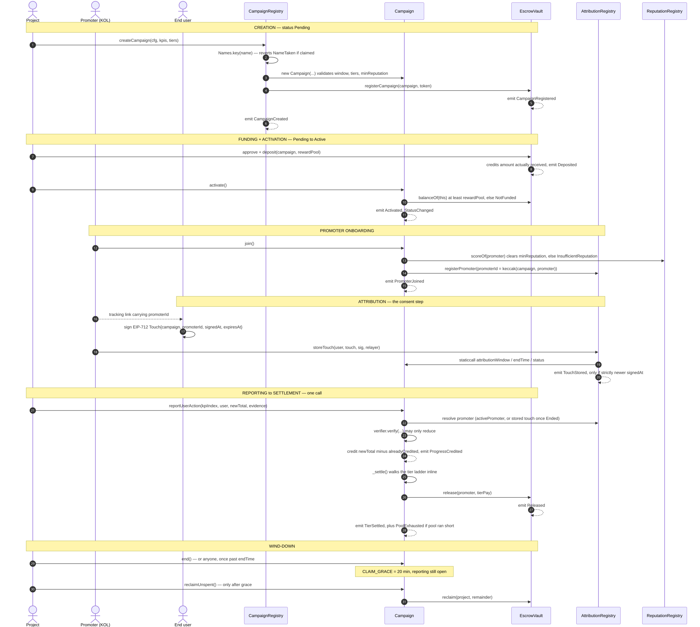

<details>
<summary>Mermaid source</summary>

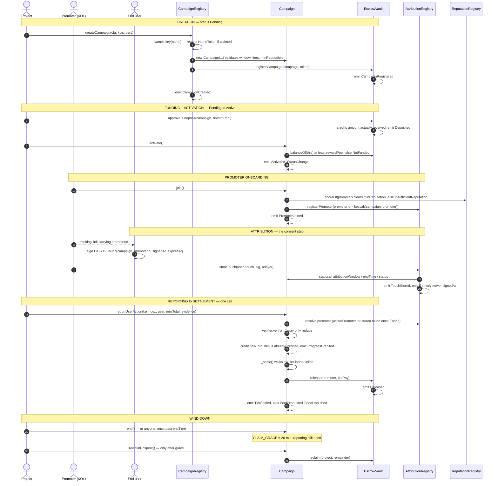

</details>

---

## 2. Lifecycle

`Paused` blocks reporting but cannot strand anyone: `end()` is permissionless once `endTime` passes,
which converts a parked campaign into an `Ended` one and starts the grace clock.


<details>
<summary>Mermaid source</summary>

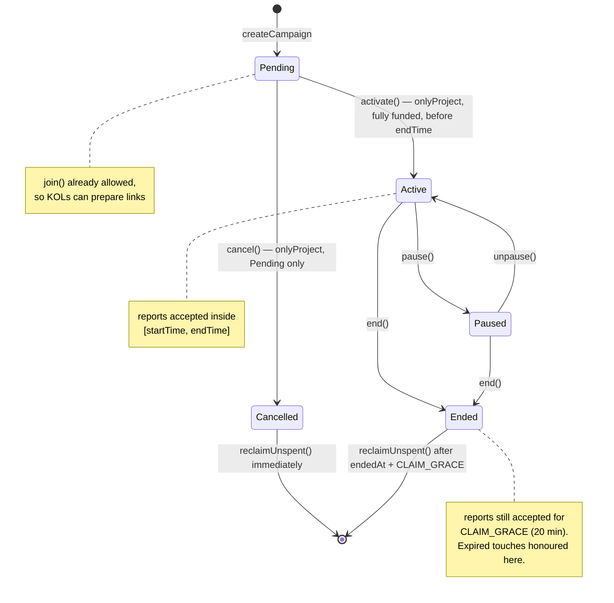

</details>

**The key invariant:** reporting and reclaim are exact complements. Reporting closes at
`endedAt + CLAIM_GRACE`; `reclaimUnspent` opens strictly after it. Escrow is never reclaimable
while credit is still owed, and the two windows can never both be open.

---

## 3. Inside `reportUserAction`

Everything below happens in one transaction. There is no separate claim step — `_settle` runs at
the end of every crediting report.


<details>
<summary>Mermaid source</summary>

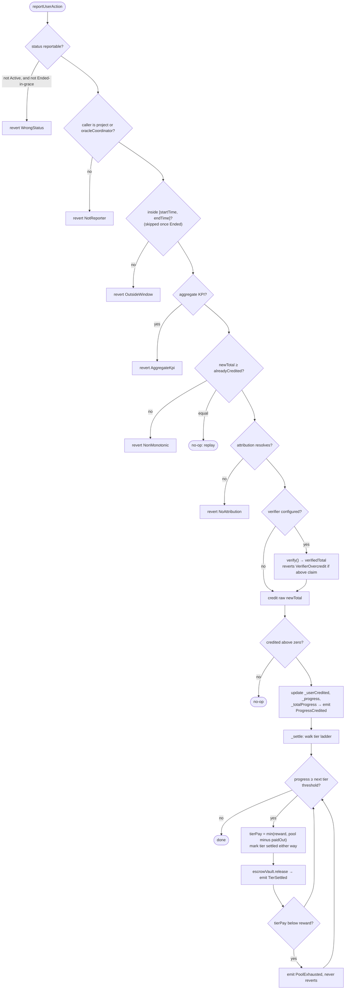

</details>

### Attribution resolution


<details>
<summary>Mermaid source</summary>

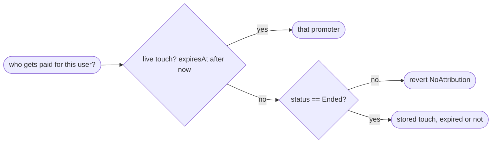

</details>

The post-end relaxation exists so withheld reports filed during `CLAIM_GRACE` don't all revert
`NoAttribution` — which would hand the project back exactly the escrow the grace window protects.
It is safe only because `storeTouch` refuses a touch once the campaign is past `endTime` or
terminal, so the stored touch is the user's latest intent *from while the campaign was running*.

---

## 4. Two ways a report reaches the campaign

The oracle path is what makes a promoter payable without the project's cooperation.


<details>
<summary>Mermaid source</summary>

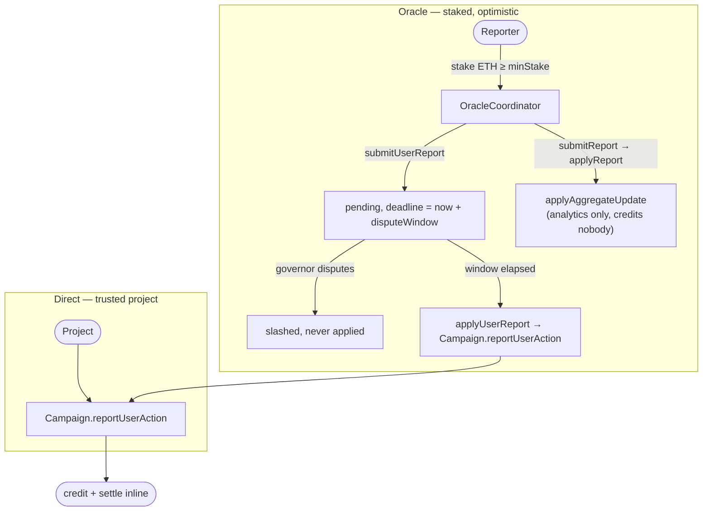

</details>

## 5. Verifier composition

A verifier may only ever shrink a claim, and can never redirect the payee. `Campaign` independently
rejects any verifier returning more than was claimed.


<details>
<summary>Mermaid source</summary>


</details>

`EventMetricKpiVerifier` exists because Solidity cannot read historical logs — there is no
`eth_getLogs` on chain. A trusted relayer scans the real logs off-chain and pushes totals ahead of
time; `verify` is then a stored-value lookup and a comparison.

---

## 6. Off-chain: what the UI and subgraph read


<details>
<summary>Mermaid source</summary>

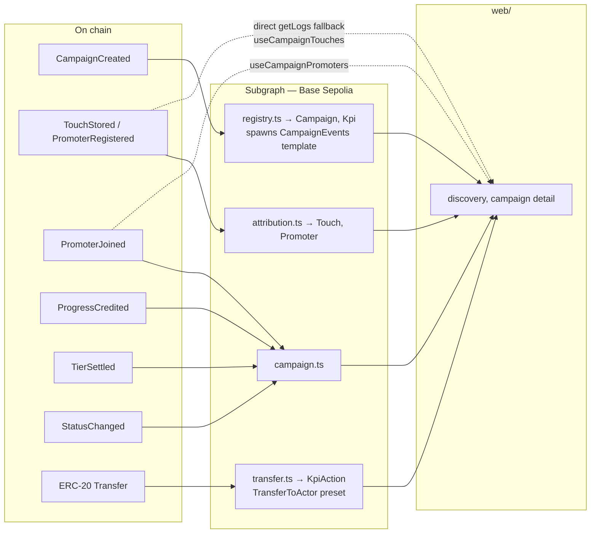

</details>

`startBlock` is the `CampaignRegistry` **deployment** block, not a recent one: templates only spawn
from `CampaignCreated`, and a dynamically created data source never indexes blocks before it was
spawned. Starting late means already-deployed campaigns never spawn their KPI templates and the
subgraph syncs clean while indexing nothing.

---

## Notes on things that surprise people

- **There is no claim step.** `_settle` runs inline at the end of every crediting report, so by the
  time anyone calls the public `Campaign.settle` (or `Boney.claimRewards`), `_settledTiers` is
  already caught up and the ladder walk pays zero. The public entry point is permissionless and
  correct, but dormant by construction.
- **Reported amounts are cumulative per user, not deltas.** Only `newTotal − alreadyCredited` is
  applied, so a replayed report is a no-op rather than an inflation vector.
- **Pool exhaustion never reverts.** A crossed tier is marked settled even when the pool cannot
  cover it, and the shortfall surfaces as `PoolExhausted`. Reverting would let one exhausted tier
  block all further reporting for everyone.
- **The facade is not trusted.** `Boney` can be replaced, or several run in parallel for different
  frontends, with no migration of escrow or campaign state.
- **Deposits credit what actually arrived.** The vault uses an internal ledger rather than
  `token.balanceOf(this)`, so a fee-on-transfer token, a rebase, or an unsolicited transfer cannot
  shift another campaign's spendable balance.
